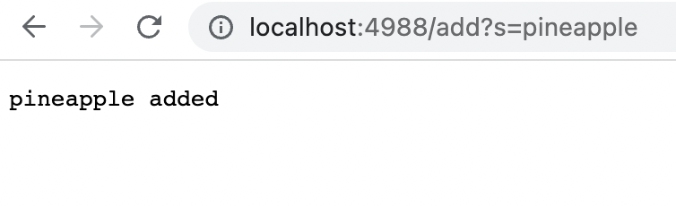
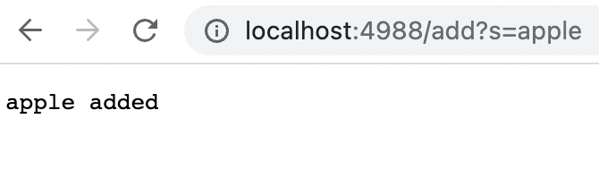
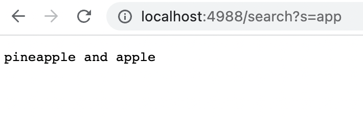

# Lab Report 3
# Part 1:
**This is the code I created for my SearchEngine:**
<pre><code>import java.io.IOException;
import java.net.URI;
import java.util.ArrayList; // import the ArrayList class

class Handler implements URLHandler {
    // The one bit of state on the server: a number that will be manipulated by
    // various requests.
    int num = 0;
    ArrayList<String> words = new ArrayList<String>();
    public String handleRequest(URI url) {
        if (url.getPath().equals("/")) {
            return String.format("Number: %d", num);
        } else if (url.getPath().equals("/increment")) {
            num += 1;
            return String.format("Number incremented!");
        } 
        else if (url.getPath().equals("/search")){
            String[] parameters = url.getQuery().split("=");
            if (parameters[0].equals("s")) {
                ArrayList<String> temp = new ArrayList<String>();
                for(int i = 0; i < words.size(); i++){
                    if (words.get(i).contains(parameters[1])){
                        temp.add(words.get(i));
                        System.out.println("Temp List: ");
                        System.out.println(temp);
                    }
                }
                String searchreturn = "";
                for (int m = 0; m<temp.size();m++){
                    if(m==0){
                        searchreturn = temp.get(m);
                    }
                    if(m>0){
                        searchreturn = searchreturn + " and " + temp.get(m);
                    }
                }
                if(temp.size()!= 0){
                    return searchreturn;
                }
                else{
                    return "Doesn't exist";
                }
            }
            return "Error";
        }
        if (url.getPath().equals("/add")) {
            String[] parameters = url.getQuery().split("=");
            if (parameters[0].equals("s")) {
                words.add(parameters[1]);
            }
            if (parameters[0].equals("count")){
                num += Integer.parseInt(parameters[1]);
            }

        }
            return "404 Not Found!";
    }
}

class SearchEngine {
    public static void main(String[] args) throws IOException {
        if(args.length == 0){
            System.out.println("Missing port number! Try any number between 1024 to 49151");
            return;
        }

        int port = Integer.parseInt(args[0]);

        Server.start(port, new Handler());
    }
}
</code></pre>

The above checks to see if the path equals "/add". It then checks the query, and creates a new array 'parameters' with indice 0 before the equals sign, and indice 1 after the equals sign. The array will then be [s pineapple].

Then, if s is the zero indice (parameters[0]), it adds indice 1 (parameters[1]) to the list of words (which is an ArrayList). As such, pineapple will be added to the list of words.

  

The above checks to see if the path equals "/add". It then checks the query, and creates a new array 'parameters' with indice 0 before the equals sign, and indice 1 after the equals sign. The array will then be [s apple].

Then, if s is the zero indice (parameters[0]), it adds indice 1 (parameters[1]) to the list of words (which is an ArrayList). As such, apple will be added to the list of words.

  

The above checks to if the path equals "/search". It then check the query, and creates a new array 'parameters' with indice 0 before the equals sign, and indice 1 after the equals sign. The array will then be [s app]

Then, since indice 0 is s, it will create a new ArrayList called temp. A for loop goes through the list of words previously created [pineapple apple]. It checks each indice to see if the word contains 'app'. If it does contain 'app', then it will be added to temp. Since both pineapple and apple contain 'app', they will be added to temp. 

The ArrayList temp is what we'd like to return, but we must return a String. Therefore, a new String searchreturn is created and initialized to be blank. Then, a for loop is created to go through each indice of temp. If temp has more than one element, it must be appended with an 'and'. So, the String appends itself, an 'and', and the next element in the list. 

As such, the String becomes pineapple and apple.

# Part 2:
**Reversed Method:**
For the reveresed method in ArrayExamples.java I inputted an array [5 6 7] and expected the output [7 6 5]. 

The provided code outputted 0 instead of 7 for the first index. 

The bug is that it instead of putting the last element into the first element of the return array, it takes the length of the array (3), and subtracts the index point (2), and then subtracts 1, which equals 0. 

**My improved code:**
<pre><code>
  static int[] reversed(int[] arr) {
    int[] newArray = new int[arr.length];
    int count = 0;
    for(int i = arr.length - 1; i > -1; i = i -1) {
      newArray[count] = arr[i];
      count++;
    }
    return newArray;
  }
</code></pre>

This code works from back to front. It starts at the end of the provided array, and inputs that into a new array. 

The previous code was completely broken, and it's implementation would only work in rare cases. 

**Merge Method:**

I inputted 

list 1 = [a c]

List 2 = [b d]

And received a Java heap space error.

The code takes 2 lists, list 1 and list 2.

Additionally, it creates 2 index point trackers, index1 and index2 to track the index point on their respective lists. 

The issue is very small. Everything seems to work well until the end of the code. 

It should create the return list [a b c], with index1 = 2 and index2 = 1.

This means the the program enters a while loop:

<pre><code>
    while(index2 < list2.size()) {
      result.add(list2.get(index2));
      index1 += 1;
    }
</code></pre>

This loop will never end since it's incrementing index1, rather than index 2, which is integral to stopping the while loop. 

My updated code solves the problem and also works for any data entered, even if unordered. 

<pre><code>
static List<String> merge(List<String> list1, List<String> list2) {
    List<String> result = new ArrayList<>();
    List<String> tempList = new ArrayList<>();
    for (int i = 0; i<list1.size(); i++){
      tempList.add(list1.get(i));
    }
    for (int i = 0; i<list2.size(); i++){
      tempList.add(list2.get(i));
    }
    int size = tempList.size();
    for (int j = 0; j<size; j++){
      String currentsmallest = tempList.get(0);
      for (int i = 0; i<tempList.size(); i++){
        if (currentsmallest.compareTo(tempList.get(i)) > 0){
          currentsmallest = tempList.get(i);
        }
      }
      result.add(currentsmallest);
      int count = 0;
      for(int m = 0; m < tempList.size(); m++){
        if (tempList.get(m).equals(currentsmallest)){
          tempList.remove(m);
        }
      }
    }
    return result;
      }
</code></pre>

This code places both lists into one list. Then, it finds the string within the List of lowest value with a for loop, and adds it to the result list, and removes it from the argument. It repeats this for loop until it's gone through all elements, and they're reordered into the result List. Then it returns the result.